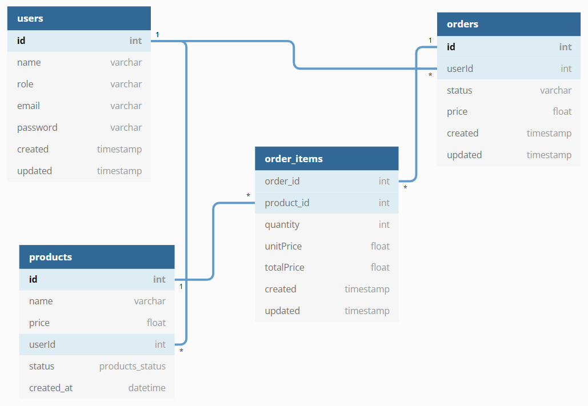

# Ordering System

This project was develoepd using NestJS + React + Typescript + GraphQL + SQLite + [Nx](https://nx.dev).

## Database Design

## Steps to run this project
1. Git clone the porject
2. Go to project directory and run `npm install`
3. Run `npm run dev` to run `api` and `client` concurrently
4. `api` can be accessed at `http://localhost:8000/graphql`
5. `client` can be accessed at `http://localhost:4200/`

## Account Credentials

### Seller
Email: seller@gmail.com

Password: password123

### Buyer
Email: buyer@gmail.com

Password: password123
   
## Todo
1. Seller manage orders
2. Add search bar
3. Add sorting